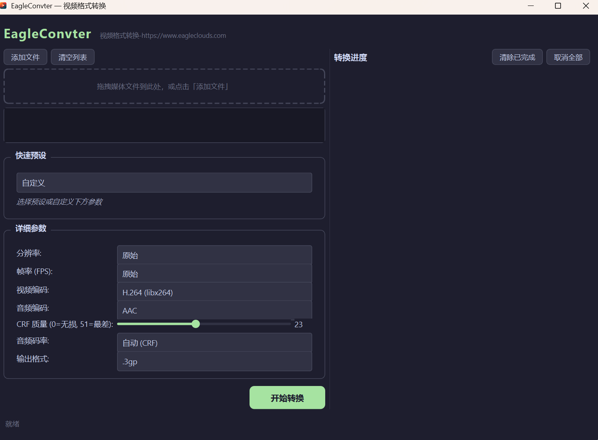

# EagleConvter

媒体格式转换桌面工具，基于 FFmpeg + PySide6。



## 功能

- **拖拽添加** — 拖拽或浏览添加媒体文件，自动显示编码/分辨率/时长
- **18 种预设** — 一键选择 MP4/AVI/MKV/WEBM/MOV/GIF/3GP/MPEG/OGV 及音频格式
- **详细参数** — 分辨率 / FPS / 视频编码 / 音频编码 / CRF 质量 / 音频码率
- **批量转换** — 串行队列，依次处理多个文件
- **实时进度** — 进度条 + FPS + 速率 + ETA + 已用时间
- **右键菜单** — 每个任务可「另存为」更改输出路径、「打开输出文件夹」
- **深色主题** — Catppuccin Mocha 暗色风格
- **音频提取** — 支持视频转 MP3/FLAC/WAV/AAC/Opus

## 预设列表

| 预设 | 格式 | 视频编码 | 音频编码 |
|------|------|----------|----------|
| MP4 H.264 | .mp4 | libx264 | aac |
| MP4 H.265 | .mp4 | libx265 | aac |
| AVI | .avi | mpeg4 | mp3 |
| MKV H.265 | .mkv | libx265 | aac |
| WEBM VP9 | .webm | libvpx-vp9 | libopus |
| WEBM VP8 | .webm | libvpx | libvorbis |
| MOV | .mov | libx264 | aac |
| GIF | .gif | gif | — |
| iPhone | .mp4 | libx264 | aac |
| Telegram | .mp4 | libx264 | aac |
| 3GP H.263 | .3gp | h263 | aac |
| MPEG-2 | .mpg | mpeg2video | mp2 |
| OGV Theora | .ogv | libtheora | libvorbis |
| MP3 音频 | .mp3 | copy | libmp3lame |
| FLAC 无损音频 | .flac | copy | flac |
| WAV PCM | .wav | copy | pcm_s16le |
| AAC 音频 | .m4a | copy | aac |
| OPUS 音频 | .ogg | copy | libopus |

## 系统要求

- Windows 10/11
- [FFmpeg](https://ffmpeg.org/) 已安装并加入 PATH

## 开发

```bash
# 克隆
git clone https://github.com/yourname/EagleConvter.git
cd EagleConvter

# 安装依赖
pip install -r requirements.txt

# 运行
python main.py

# 打包
pyinstaller --onedir --windowed --name EagleConvter --icon resources/app.ico --add-data "resources/styles.qss;resources" --add-data "resources/app.png;resources" main.py
```

## 项目结构

```
convter/
├── main.py                 # 入口
├── requirements.txt        # 依赖
├── core/
│   ├── formats.py          # 预设/编码器/分辨率
│   ├── ffmpeg.py           # FFmpeg 子进程 + 进度解析
│   └── task.py             # 任务队列 + 后台线程
├── ui/
│   ├── main_window.py      # 主窗口
│   ├── file_panel.py       # 文件列表 + 拖拽
│   ├── format_panel.py     # 参数选择
│   └── progress_panel.py   # 进度展示
└── resources/
    ├── styles.qss          # 暗色主题
    ├── app.png             # 应用图标
    └── app.ico             # Windows 图标
```
